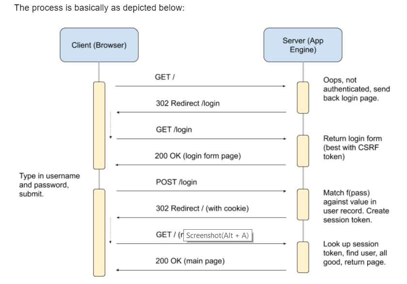

The server determines whether you are logged in, not the browser. Always, always, always the server. Let's look at what happens when you try to access your home page without being logged in.
- Client: send request for path /index.html (or / or similar)
- Server: check for session cookie. It either 1) isn't there, 2) is expired, or 3) is there but doesn't match anything in the database.
- Server: send back 302 with the Location: /login header (flask makes this easy and natural)
- Client: requests GET /login.html (obeying the server's response without your help)
- Server: serves /login.html, which has a form in it with method="POST" and action="/login"
- User: enter credentials, hit "login", browser sends to server (POSTs the form to the /login endpoint)
- Server: gets username and password from the form data, stretches password, looks up user in database, compares stretched passwords.
- Server: if stretched passwords match, creates a new session token (just a random string), stores it in the user's database record with an expiration time, and returns 302 with Location: / and a Set-Cookie: session=<your session ID here> header (again, Flask makes this easy).
- Browser: Gets the response, automatically sets the cookie for you, then automatically requests / (because the server asked it to in the 302 redirect response)
- Server: Gets a request for /, checks for the session cookie, finds it, looks it up in the database, finds it there, determines that it is not expired, and finally serves the actual home page for this user.

So the server has just a couple of jobs:
Someone asks for a protected page:
- It checks for a valid session. If there, it serves the page for the attached user.
- If not there, or not valid, it redirects to /login every time.
Someone asks for /login or /register or some unprotected page:
- It just serves them.
Someone POST s to /login or /register:
- It takes the form data and does either login or registration.
- Login involves comparing the stretched password against what's already stored for that user, creating a session token, and redirecting them to /.
- Registration involves creating a new user and storing the stretched password.
As is always the case, the browser has basically one job: make a request and display or obey (in the case of 302) the response. 

There will be a couple of new things you will add to your document store. If you are using AppEngine, this will be directly applicable. If you are using something else, you’ll need to translate the concepts to whatever you are using.
In this lab, you will be creating a new “User” key type, and in that user you will store things like
- email address
- session key
- stretched password (e.g., output of bcrypt)
- session expiration
In the previous lab, you used the “Root” key type as the parent for all entities in the database, which ensured that reading from the database after adding a new event resulted in that new event being returned. In this lab, the event data will use the corresponding user’s key as the parent, instead.
This means that you always need to know who the user is. How do you do that?
There are a couple of pieces to this: registration and authentication
For registration, you basically need to get email/username, password from the browser, somehow, then store a new user in the database with that information (but stretch the password first, don’t store it raw!).
After a person is registered, they should then be able to authenticate in a login form of some kind. What does that process look like?
- browser: display login.html (or whatever you call it)
- user: enter username and password
- browser: POST username and password to a login endpoint on the server
- server: look up user in database, get record, stretch and compare password.
- server: if password is good, generate a new session token, store in the database with an expiration time
- server: return a redirect to the main events page, with a cookie containing the session token, that expires at the proper time
Then, every other page that the user gets (except for login and register pages, which don’t assume a logged-in user) will need to do this:
- Get the session cookie
- Look up the user by session token value
- If not there, then redirect to the login/registration page
- If there, ensure that it hasn’t expired, then
- Return the requested content.
1:07
This seems like a lot, but the cool thing is you have already done most of this. It’s small changes now, not big ones.